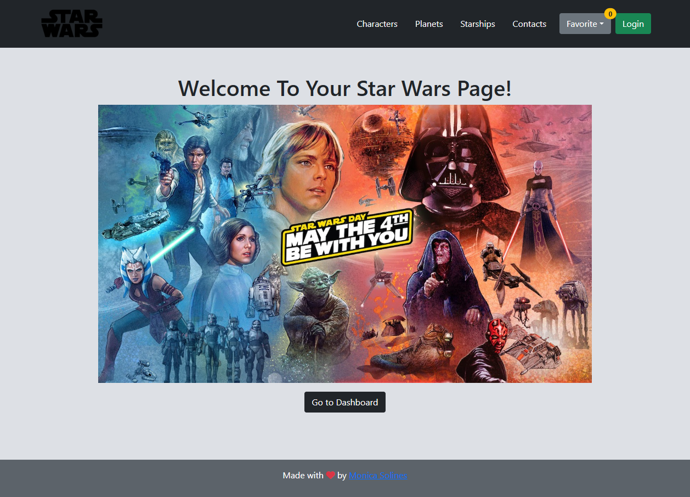
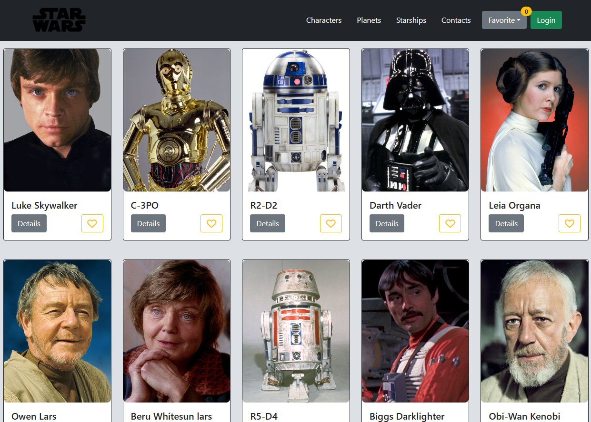
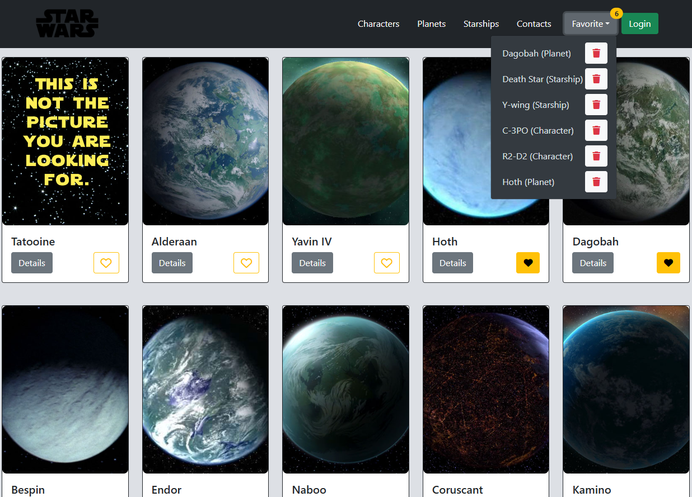

# Star Wars Blog 🌌  
**Explore the Galaxy Far, Far Away!**

## 📖 Description  
Star Wars Blog is a simple and intuitive platform that allows users to discover detailed information about characters, planets, and starships from the Star Wars universe. Users can also create contacts, add their favorite items, and share their discoveries with others.

---

## ✨ Key Features  
- **Character Profiles**: Learn about iconic Star Wars characters, including their background and role in the galaxy.  
- **Planets Overview**: Explore details of planets like Tatooine, Alderaan, and Coruscant.  
- **Starships Data**: Get specs and history of famous starships, including the Millennium Falcon and Star Destroyers.  
- **Favorites Management**: Save your favorite characters, planets, or starships and access them from a dropdown menu.  
- **Contact Sharing**: Add and manage your contacts to share your favorite Star Wars content.  
- **Dynamic User Experience**: Features a responsive and visually appealing interface that works on all devices.  

---

## 🛠️ Technologies Used  

### **Frontend**  
- **HTML5**: Semantic and structured content layout.  
- **CSS3**: Custom styles for a responsive design.  
- **Bootstrap**: Quick and effective component styling and layout management.  
- **JavaScript**: Client-side logic and interactivity.  
- **React.js**: For building reusable components and managing state with Flux.

### **Backend**  
- **Python**: Handles server-side logic and data manipulation.  
- **Flask**: A robust web framework for managing routes, authentication, and database connections.  
- **SQLAlchemy**: For managing a reliable database that stores user data, favorites, and contacts.  
- **APIs**: Custom API integrations to fetch detailed Star Wars data (characters, planets, and starships).  

### **Data Management**  
- **Flux Architecture**: Efficiently manages global state across the application.  
- **Custom APIs**: Provide endpoints to manage data such as characters, favorites, and contacts.

---

## 📷 Screenshots  

### Characters Section  

### Planets Section with Favorites  

